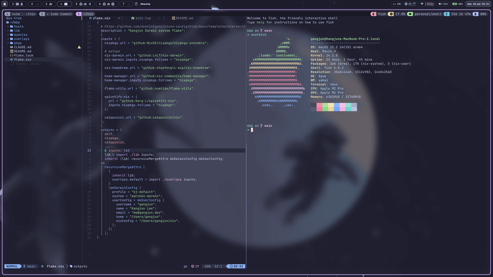

# Nix Darwin Configuration

A declarative macOS system configuration using [nix-darwin](https://github.com/LnL7/nix-darwin) and [home-manager](https://github.com/nix-community/home-manager).



## Overview

This configuration transforms macOS into a keyboard-driven development powerhouse featuring:

- **Color schema**: [Catppuccin](https://github.com/catppuccin/catppuccin)
- **Window Management**: [Yabai](https://github.com/koekeishiya/yabai) + [skhd](https://github.com/koekeishiya/skhd)
- **Status Bar**: [Sketchybar](https://github.com/FelixKratz/SketchyBar)
- **Terminal**: [Ghostty](https://ghostty.org/) + [tmux](https://github.com/tmux/tmux)
- **Shell**: [Fish shell](https://fishshell.com) ([Starship](https://starship.rs/))
- **Editor**: [Neovim](https://neovim.io) ([LazyVim](https://www.lazyvim.org/))
- **Development Tools**

## Quick Start

### Prerequisites

- macOS (Apple Silicon supported)
- [Nix](https://nixos.org/download.html) package manager
- Command Line Tools for Xcode

### Installation

1. Clone this repository:

```bash
git clone https://github.com/yourusername/nix-config.git ~/nix
cd ~/nix
```

2. Apply the configuration:

```bash
darwin-rebuild switch --flake .#kj-default
```

## Repository Structure

```
.
├── flake.nix                 # Main entry point
├── hosts/                    # System-specific configurations
├── modules/
│   ├── darwin/              # macOS-specific modules
│   │   ├── home/           # User configuration
│   │   ├── homebrew.nix    # Homebrew packages
│   │   └── yabai/          # Window manager config
│   └── shared/              # Cross-platform modules
│       ├── files/          # Dotfiles and configs
│       └── home/           # User packages
├── lib/                      # Helper functions
├── overlays/                 # Package overlays
└── pkgs/                     # Custom packages
```

## Keyboard WM Keymap

This keymap is optimized for split keyboards. The left hand controls workspace navigation while the right hand manages window operations.

> **Note**: Split keyboard firmware keymap configuration will be uploaded to a separate repository soon.

### Left Hand - Workspace Control

| Key   | Function          | Shift             | Alt+Shift     |
| ----- | ----------------- | ----------------- | ------------- |
| **Q** | Balance windows   | Mirror X-axis     | Mirror Y-axis |
| **W** | Focus space 7     | Move to space 7   | -             |
| **E** | Focus space 8     | Move to space 8   | -             |
| **R** | Focus space 9     | Move to space 9   | -             |
| **T** | Workspace setup 1 | Workspace setup 2 | -             |
| **A** | Focus monitor 2   | -                 | -             |
| **S** | Focus space 4     | Move to space 4   | -             |
| **D** | Focus space 5     | Move to space 5   | -             |
| **F** | Focus space 6     | Move to space 6   | -             |
| **G** | Float/Grid window | -                 | -             |
| **Z** | Focus monitor 1   | -                 | -             |
| **X** | Focus space 1     | Move to space 1   | -             |
| **C** | Focus space 2     | Move to space 2   | -             |
| **V** | Focus space 3     | Move to space 3   | -             |
| **B** | Maximize window   | -                 | -             |

### Right Hand - Window Control

| Key   | Function            | Shift                    | Alt         |
| ----- | ------------------- | ------------------------ | ----------- |
| **I** | Stack next          | -                        | -           |
| **O** | Stack previous      | -                        | -           |
| **H** | Focus left          | Move left                | Stack left  |
| **J** | Focus down          | Move down                | Stack down  |
| **K** | Focus up            | Move up                  | Stack up    |
| **L** | Focus right         | Move right               | Stack right |
| **N** | Rotate clockwise    | Rotate counter-clockwise | -           |
| **M** | Increase left size  | Decrease left size       | -           |
| **,** | Increase up size    | Decrease up size         | -           |
| **.** | Increase down size  | Decrease down size       | -           |
| **/** | Increase right size | Decrease right size      | -           |

## Maintenance

```bash
# Update flake inputs
nix flake update

# Rebuild after changes
sudo darwin-rebuild switch --flake .#kj-default
```

## References

- [AlexNabokikh/nix-config](https://github.com/AlexNabokikh/nix-config)
- [sudosubin/nixos-config](https://github.com/sudosubin/nixos-config)
- [DavSanchez/nix-dotfiles](https://github.com/DavSanchez/nix-dotfiles)
- [thiagokokada/nix-configs](https://github.com/thiagokokada/nix-configs)
- [khaneliman/khanelinix](https://github.com/khaneliman/khanelinix)

## License

This project is open source and available under the [MIT License](LICENSE).
